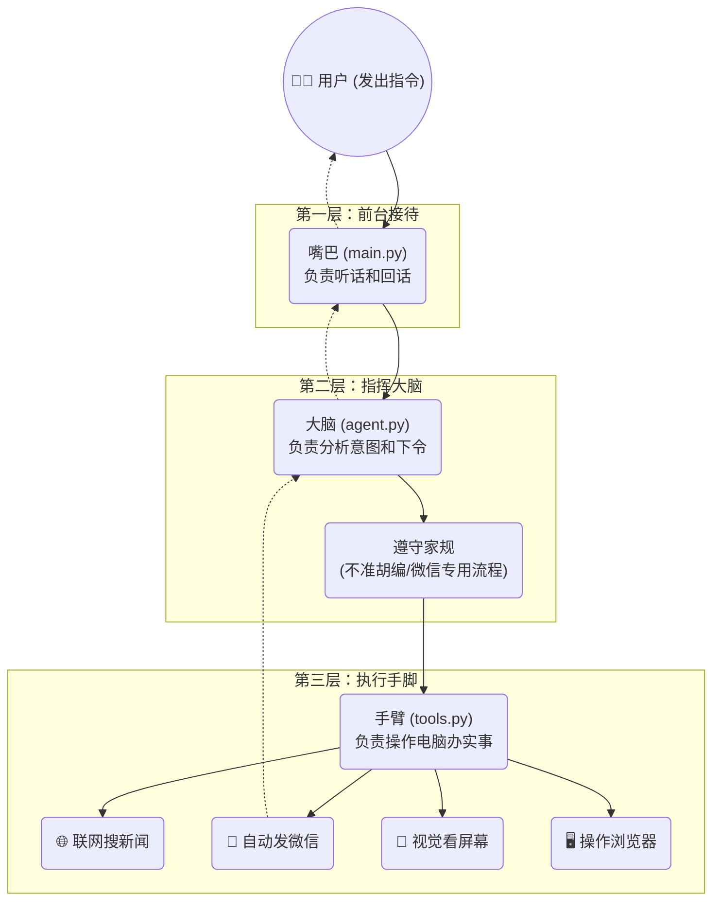

# AI 智能助理 (Agent) 运转原理：竖向极简版

为了方便您在手机或窄窗口上下滑动查看，我将架构调整为了纯竖向的逻辑流。

---

## 🔝 核心逻辑流 (竖向架构)

---

## 🔄 极简三步走

1.  **听令**：你在 `main.py` 输入文字，接待员把话传给大脑。
2.  **办事**：`agent.py` 指挥官翻开工具箱 `tools.py`，派派手脚去上网、翻微信、看图。
3.  **结果**：小助手办完事，原路返回告诉你结果。

---

## 📂 文件分工一览

*   **`main.py`**：你的“对讲机”。
*   **`agent.py`**：它的“逻辑核心”。
*   **`tools.py`**：它的“万能工具箱”。
